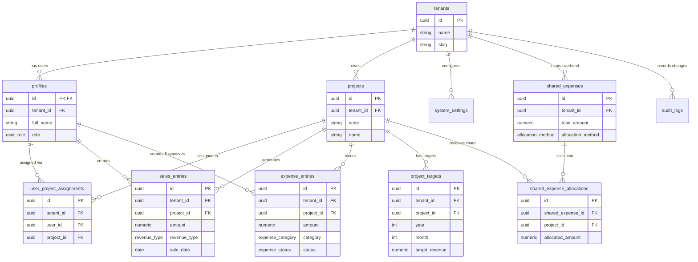

# Business Command Centre — PostgreSQL Data Model & Database Specification

**Dokumen:** Spesifikasi Reka Bentuk Pangkalan Data (Data Model & Schema Spec)  
**Syarikat:** Koperasi Pembangunan Usahasama Masyarakat Maju Sabah Berhad (Kop-Pusamaju) / SaaS Multi-Tenant Platform  
**Penulis:** Lead Database Architect & Senior Engineer (Iskandar)  
**Tarikh:** 26 Julai 2026  
**Versi:** 1.0  
**Status:** Disahkan & Sedia Untuk Migrasi Supabase  

---

## 1. Pengenalan & Prinsip Seni Bina Pangkalan Data

Dokumen ini mendefinisikan skema pangkalan data PostgreSQL menyeluruh bagi **Business Command Centre** Kop-Pusamaju. Rekabentuk ini dibina di atas infrastruktur **Supabase** (PostgreSQL 15+) dan direka khas untuk memenuhi keperluan Fasa 1 MVP sambil memastikan **Multi-Tenancy Readiness** sepenuhnya untuk fasa komersial SaaS.

### Prinsip Utama Reka Bentuk:
1. **Multi-Tenancy Readiness (Tenant Isolation)**:
   - Setiap jadual (kecuali jadual sistem global) mempunyai lajur `tenant_id (UUID)` yang merujuk kepada jadual `tenants`.
   - Indeks prestasi ditambahi dengan `tenant_id` untuk memastikan pengasingan data dan carian pantas.
2. **Keselamatan Berperingkat Pangkalan Data (Supabase RLS)**:
   - Hak akses disemak secara langsung di peringkat database menggunakan **Supabase Row Level Security (RLS)**.
   - Mengaplikasikan prinsip *Least Privilege* berasaskan Matriks Hak Akses (Super Admin, CEO, Director, Pengurus Projek, Admin).
3. **Integriti Data & Workflow Management**:
   - Penggunaan **PostgreSQL Custom ENUMs** untuk jenis hasil, kategori perbelanjaan, status kelulusan, kaedah pembayaran, dan peranan pengguna.
   - Integriti rujukan (Foreign Keys) diset dengan tindakan `RESTRICT`, `CASCADE`, atau `SET NULL` yang bersesuaian bagi mengelakkan kebocoran atau kehilangan rekod transaksi.
4. **Jejak Audit Automatik (Audit Trail)**:
   - Pencatatan automatik melalui **PL/pgSQL Trigger Functions** untuk menangkap sebarang operasi `INSERT`, `UPDATE`, atau `DELETE` pada data sensitif tanpa bergantung kepada aplikasi frontend/backend.
5. **Kecekapan Prestasi (Indexing Strategy)**:
   - Composite B-Tree indexes pada gabungan `(tenant_id, project_id, date)` untuk menyokong julat carian dashboard yang pantas (< 3 saat).

---

## 2. PostgreSQL ENUM Types & Domain Constraints

Bagi memastikan *type safety* dan mengelakkan ralat data string acak, ENUM khas berikut dicipta dalam skema `public`:

```sql
-- 1. Peranan Pengguna (User Roles)
CREATE TYPE public.user_role AS ENUM (
  'super_admin',
  'ceo',
  'director',
  'project_manager',
  'admin'
);

-- 2. Jenis Hasil (Revenue Types)
CREATE TYPE public.revenue_type AS ENUM (
  'regular',          -- Jualan biasa / One-time sales
  'recurring',        -- Hasil berulang / Langganan
  'advance_deposit'   -- Bayaran pendahuluan / Deposit
);

-- 3. Kaedah Pembayaran (Payment Methods)
CREATE TYPE public.payment_method AS ENUM (
  'cash',
  'bank_transfer',
  'card'
);

-- 4. Kategori Perbelanjaan (Expense Categories)
CREATE TYPE public.expense_category AS ENUM (
  'salaries_wages',           -- Gaji dan upah kakitangan
  'marketing_advertising',    -- Kos pemasaran dan pengiklanan
  'daily_operations',         -- Kos operasi harian
  'supplier_raw_materials',   -- Kos pembekal / bahan mentah
  'rent',                     -- Sewa premis
  'utilities',                -- Utiliti (elektrik, air, internet)
  'sales_commission',         -- Komisen jualan
  'travel_transport',         -- Perjalanan dan pengangkutan
  'equipment_tech',           -- Peralatan dan teknologi
  'others'                    -- Lain-lain
);

-- 5. Status Kelulusan Perbelanjaan (Expense Approval Status)
CREATE TYPE public.expense_status AS ENUM (
  'pending',    -- Menunggu Kelulusan CEO
  'approved',   -- Diluluskan
  'rejected'    -- Ditolak
);

-- 6. Kaedah Agihan Kos Bersama (Shared Expense Allocation Method)
CREATE TYPE public.allocation_method AS ENUM (
  'manual',                     -- Agihan jumlah/peratus manual
  'proportional_by_revenue'    -- Agihan berkadar berdasarkan hasil projek
);
```

---

## 3. Definisi Jadual (Relational Schema DDL)

### 3.1 `tenants`
Mengandungi maklumat organisasi/koperasi yang menggunakan sistem (Tenant).
```sql
CREATE TABLE public.tenants (
  id UUID PRIMARY KEY DEFAULT gen_random_uuid(),
  name VARCHAR(255) NOT NULL,
  slug VARCHAR(100) NOT NULL UNIQUE,
  logo_url TEXT NULL,
  is_active BOOLEAN NOT NULL DEFAULT true,
  created_at TIMESTAMPTZ NOT NULL DEFAULT now(),
  updated_at TIMESTAMPTZ NOT NULL DEFAULT now()
);
```

### 3.2 `profiles`
Profil pengguna yang dihubungkan secara langsung kepada `auth.users` Supabase.
```sql
CREATE TABLE public.profiles (
  id UUID PRIMARY KEY REFERENCES auth.users(id) ON DELETE CASCADE,
  tenant_id UUID NOT NULL REFERENCES public.tenants(id) ON DELETE CASCADE,
  full_name VARCHAR(255) NOT NULL,
  email VARCHAR(255) NOT NULL,
  phone_number VARCHAR(50) NULL,
  role public.user_role NOT NULL DEFAULT 'project_manager',
  is_active BOOLEAN NOT NULL DEFAULT true,
  created_at TIMESTAMPTZ NOT NULL DEFAULT now(),
  updated_at TIMESTAMPTZ NOT NULL DEFAULT now()
);
```

### 3.3 `projects`
Senarai projek perniagaan di bawah sesuatu tenant (Projek-Agnostic).
```sql
CREATE TABLE public.projects (
  id UUID PRIMARY KEY DEFAULT gen_random_uuid(),
  tenant_id UUID NOT NULL REFERENCES public.tenants(id) ON DELETE CASCADE,
  code VARCHAR(50) NOT NULL,
  name VARCHAR(255) NOT NULL,
  industry VARCHAR(100) NOT NULL,
  description TEXT NULL,
  is_active BOOLEAN NOT NULL DEFAULT true,
  created_at TIMESTAMPTZ NOT NULL DEFAULT now(),
  updated_at TIMESTAMPTZ NOT NULL DEFAULT now(),
  CONSTRAINT uq_projects_tenant_code UNIQUE (tenant_id, code)
);
```

### 3.4 `user_project_assignments`
Jadual persimpangan (junction table) memetakan Pengurus Projek kepada projek yang ditugaskan.
```sql
CREATE TABLE public.user_project_assignments (
  id UUID PRIMARY KEY DEFAULT gen_random_uuid(),
  tenant_id UUID NOT NULL REFERENCES public.tenants(id) ON DELETE CASCADE,
  user_id UUID NOT NULL REFERENCES public.profiles(id) ON DELETE CASCADE,
  project_id UUID NOT NULL REFERENCES public.projects(id) ON DELETE CASCADE,
  assigned_at TIMESTAMPTZ NOT NULL DEFAULT now(),
  CONSTRAINT uq_user_project_assignment UNIQUE (tenant_id, user_id, project_id)
);
```

### 3.5 `sales_entries`
Rekod jualan dan hasil bulanan mengikut projek.
```sql
CREATE TABLE public.sales_entries (
  id UUID PRIMARY KEY DEFAULT gen_random_uuid(),
  tenant_id UUID NOT NULL REFERENCES public.tenants(id) ON DELETE CASCADE,
  project_id UUID NOT NULL REFERENCES public.projects(id) ON DELETE RESTRICT,
  created_by UUID NOT NULL REFERENCES public.profiles(id) ON DELETE RESTRICT,
  sale_date DATE NOT NULL,
  amount NUMERIC(15, 2) NOT NULL CHECK (amount >= 0),
  revenue_type public.revenue_type NOT NULL DEFAULT 'regular',
  client_name VARCHAR(255) NULL,
  product_service_name VARCHAR(255) NOT NULL,
  payment_method public.payment_method NOT NULL DEFAULT 'bank_transfer',
  invoice_ref VARCHAR(100) NULL,
  notes TEXT NULL,
  created_at TIMESTAMPTZ NOT NULL DEFAULT now(),
  updated_at TIMESTAMPTZ NOT NULL DEFAULT now()
);
```

### 3.6 `expense_entries`
Rekod perbelanjaan projek beserta alur kerja kelulusan CEO dan dokumen sokongan.
```sql
CREATE TABLE public.expense_entries (
  id UUID PRIMARY KEY DEFAULT gen_random_uuid(),
  tenant_id UUID NOT NULL REFERENCES public.tenants(id) ON DELETE CASCADE,
  project_id UUID NOT NULL REFERENCES public.projects(id) ON DELETE RESTRICT,
  created_by UUID NOT NULL REFERENCES public.profiles(id) ON DELETE RESTRICT,
  expense_date DATE NOT NULL,
  category public.expense_category NOT NULL,
  amount NUMERIC(15, 2) NOT NULL CHECK (amount >= 0),
  description TEXT NOT NULL,
  receipt_url TEXT NULL,
  status public.expense_status NOT NULL DEFAULT 'pending',
  reviewed_by UUID NULL REFERENCES public.profiles(id) ON DELETE SET NULL,
  reviewed_at TIMESTAMPTZ NULL,
  rejection_reason TEXT NULL,
  created_at TIMESTAMPTZ NOT NULL DEFAULT now(),
  updated_at TIMESTAMPTZ NOT NULL DEFAULT now()
);
```

### 3.7 `shared_expenses`
Rekod kos bersama syarikat di peringkat induk (HQ / Corporate Overhead).
```sql
CREATE TABLE public.shared_expenses (
  id UUID PRIMARY KEY DEFAULT gen_random_uuid(),
  tenant_id UUID NOT NULL REFERENCES public.tenants(id) ON DELETE CASCADE,
  created_by UUID NOT NULL REFERENCES public.profiles(id) ON DELETE RESTRICT,
  expense_date DATE NOT NULL,
  total_amount NUMERIC(15, 2) NOT NULL CHECK (total_amount >= 0),
  category public.expense_category NOT NULL,
  description TEXT NOT NULL,
  allocation_method public.allocation_method NOT NULL DEFAULT 'manual',
  receipt_url TEXT NULL,
  created_at TIMESTAMPTZ NOT NULL DEFAULT now(),
  updated_at TIMESTAMPTZ NOT NULL DEFAULT now()
);
```

### 3.8 `shared_expense_allocations`
Pecahan agihan kos bersama kepada projek-projek aktif.
```sql
CREATE TABLE public.shared_expense_allocations (
  id UUID PRIMARY KEY DEFAULT gen_random_uuid(),
  tenant_id UUID NOT NULL REFERENCES public.tenants(id) ON DELETE CASCADE,
  shared_expense_id UUID NOT NULL REFERENCES public.shared_expenses(id) ON DELETE CASCADE,
  project_id UUID NOT NULL REFERENCES public.projects(id) ON DELETE CASCADE,
  allocated_amount NUMERIC(15, 2) NOT NULL CHECK (allocated_amount >= 0),
  allocation_percentage NUMERIC(5, 2) NOT NULL CHECK (allocation_percentage >= 0 AND allocation_percentage <= 100),
  created_at TIMESTAMPTZ NOT NULL DEFAULT now()
);
```

### 3.9 `project_targets`
Sasaran hasil bulanan dan margin keuntungan minimum mengikut projek yang ditetapkan oleh CEO.
```sql
CREATE TABLE public.project_targets (
  id UUID PRIMARY KEY DEFAULT gen_random_uuid(),
  tenant_id UUID NOT NULL REFERENCES public.tenants(id) ON DELETE CASCADE,
  project_id UUID NOT NULL REFERENCES public.projects(id) ON DELETE CASCADE,
  year INT NOT NULL CHECK (year >= 2000 AND year <= 2100),
  month INT NOT NULL CHECK (month >= 1 AND month <= 12),
  target_revenue NUMERIC(15, 2) NOT NULL CHECK (target_revenue >= 0),
  target_profit_margin NUMERIC(5, 2) NOT NULL CHECK (target_profit_margin >= 0 AND target_profit_margin <= 100),
  created_by UUID NOT NULL REFERENCES public.profiles(id) ON DELETE RESTRICT,
  created_at TIMESTAMPTZ NOT NULL DEFAULT now(),
  updated_at TIMESTAMPTZ NOT NULL DEFAULT now(),
  CONSTRAINT uq_project_target_month UNIQUE (tenant_id, project_id, year, month)
);
```

### 3.10 `system_settings`
Tetapan konfigurasi sistem per tenant (Ambang KPI, tarikh akhir, kaedah agihan lalai).
```sql
CREATE TABLE public.system_settings (
  id UUID PRIMARY KEY DEFAULT gen_random_uuid(),
  tenant_id UUID NOT NULL REFERENCES public.tenants(id) ON DELETE CASCADE,
  warning_threshold_pct NUMERIC(5, 2) NOT NULL DEFAULT 80.00 CHECK (warning_threshold_pct >= 0 AND warning_threshold_pct <= 100),
  monthly_submission_deadline_day INT NOT NULL DEFAULT 5 CHECK (monthly_submission_deadline_day >= 1 AND monthly_submission_deadline_day <= 31),
  default_allocation_method public.allocation_method NOT NULL DEFAULT 'manual',
  auto_report_enabled BOOLEAN NOT NULL DEFAULT true,
  auto_report_day_of_month INT NOT NULL DEFAULT 1 CHECK (auto_report_day_of_month >= 1 AND auto_report_day_of_month <= 28),
  created_at TIMESTAMPTZ NOT NULL DEFAULT now(),
  updated_at TIMESTAMPTZ NOT NULL DEFAULT now(),
  CONSTRAINT uq_system_settings_tenant UNIQUE (tenant_id)
);
```

### 3.11 `audit_logs`
Jadual log jejak audit untuk mencatat sebarang perubahan data penting secara automatik.
```sql
CREATE TABLE public.audit_logs (
  id UUID PRIMARY KEY DEFAULT gen_random_uuid(),
  tenant_id UUID NULL REFERENCES public.tenants(id) ON DELETE CASCADE,
  table_name VARCHAR(100) NOT NULL,
  record_id UUID NOT NULL,
  action VARCHAR(20) NOT NULL, -- 'INSERT', 'UPDATE', 'DELETE'
  old_data JSONB NULL,
  new_data JSONB NULL,
  changed_by UUID NULL REFERENCES public.profiles(id) ON DELETE SET NULL,
  created_at TIMESTAMPTZ NOT NULL DEFAULT now()
);
```

---

## 4. Entity Relationship Diagram (ERD)



---

## 5. Indeks Prestasi & Constraint Perbandingan

Bagi membolehkan dashboard memuatkan data KPI, graf trend, dan jadual perbandingan dalam masa **< 3 saat**, indeks berikut dibina:

```sql
-- Profiles & Assignments Indexes
CREATE INDEX idx_profiles_tenant_role ON public.profiles (tenant_id, role);
CREATE INDEX idx_user_project_assignments_lookup ON public.user_project_assignments (tenant_id, user_id, project_id);

-- Projects Indexes
CREATE INDEX idx_projects_tenant_active ON public.projects (tenant_id, is_active);

-- Sales Entries Performance Indexes
CREATE INDEX idx_sales_entries_tenant_project_date ON public.sales_entries (tenant_id, project_id, sale_date DESC);
CREATE INDEX idx_sales_entries_tenant_date ON public.sales_entries (tenant_id, sale_date DESC);

-- Expense Entries Performance Indexes
CREATE INDEX idx_expense_entries_tenant_project_date ON public.expense_entries (tenant_id, project_id, expense_date DESC);
CREATE INDEX idx_expense_entries_tenant_status ON public.expense_entries (tenant_id, status);

-- Shared Expenses & Allocations Indexes
CREATE INDEX idx_shared_expenses_tenant_date ON public.shared_expenses (tenant_id, expense_date DESC);
CREATE INDEX idx_shared_allocations_lookup ON public.shared_expense_allocations (tenant_id, project_id, shared_expense_id);

-- Project Targets Lookup Index
CREATE INDEX idx_project_targets_lookup ON public.project_targets (tenant_id, project_id, year, month);

-- Audit Logs Filtering Index
CREATE INDEX idx_audit_logs_lookup ON public.audit_logs (tenant_id, table_name, record_id, created_at DESC);
```

---

## 6. Polisi Supabase Row Level Security (RLS) & Fungsi Bantuan

### 6.1 Fungsi Bantuan (Helper Functions) PL/pgSQL

Untuk memastikan RLS beroperasi dengan cekap tanpa query berulang:

```sql
-- 1. Dapatkan Profile pengguna semasa
CREATE OR REPLACE FUNCTION public.get_current_user_profile()
RETURNS TABLE (
  user_id UUID,
  tenant_id UUID,
  role public.user_role,
  is_active BOOLEAN
) 
LANGUAGE sql STABLE SECURITY DEFINER
SET search_path = public
AS $$
  SELECT id, tenant_id, role, is_active
  FROM public.profiles
  WHERE id = auth.uid() AND is_active = true;
$$;

-- 2. Semak adakah Pengurus Projek ditugaskan kepada sesuatu projek
CREATE OR REPLACE FUNCTION public.is_project_assigned(p_project_id UUID)
RETURNS BOOLEAN
LANGUAGE sql STABLE SECURITY DEFINER
SET search_path = public
AS $$
  SELECT EXISTS (
    SELECT 1 
    FROM public.user_project_assignments upa
    JOIN public.profiles prof ON prof.id = upa.user_id
    WHERE upa.user_id = auth.uid()
      AND upa.project_id = p_project_id
      AND prof.is_active = true
  );
$$;
```

---

### 6.2 Polisi RLS Terperinci Mengikut Jadual

Dayakan RLS pada semua jadual:
```sql
ALTER TABLE public.tenants ENABLE ROW LEVEL SECURITY;
ALTER TABLE public.profiles ENABLE ROW LEVEL SECURITY;
ALTER TABLE public.projects ENABLE ROW LEVEL SECURITY;
ALTER TABLE public.user_project_assignments ENABLE ROW LEVEL SECURITY;
ALTER TABLE public.sales_entries ENABLE ROW LEVEL SECURITY;
ALTER TABLE public.expense_entries ENABLE ROW LEVEL SECURITY;
ALTER TABLE public.shared_expenses ENABLE ROW LEVEL SECURITY;
ALTER TABLE public.shared_expense_allocations ENABLE ROW LEVEL SECURITY;
ALTER TABLE public.project_targets ENABLE ROW LEVEL SECURITY;
ALTER TABLE public.system_settings ENABLE ROW LEVEL SECURITY;
ALTER TABLE public.audit_logs ENABLE ROW LEVEL SECURITY;
```

#### A. Polisi `tenants`
```sql
-- Pengguna hanya boleh melihat maklumat tenant mereka sendiri
CREATE POLICY tenants_select_policy ON public.tenants
  FOR SELECT TO authenticated
  USING (
    id = (SELECT tenant_id FROM public.get_current_user_profile())
  );
```

#### B. Polisi `profiles`
```sql
-- Pengguna boleh lihat semua profil dalam tenant sama
CREATE POLICY profiles_select_policy ON public.profiles
  FOR SELECT TO authenticated
  USING (
    tenant_id = (SELECT tenant_id FROM public.get_current_user_profile())
  );

-- Admin dan Super Admin sahaja boleh tambah/kemaskini profil
CREATE POLICY profiles_insert_policy ON public.profiles
  FOR INSERT TO authenticated
  WITH CHECK (
    tenant_id = (SELECT tenant_id FROM public.get_current_user_profile())
    AND (SELECT role FROM public.get_current_user_profile()) IN ('super_admin', 'admin')
  );

CREATE POLICY profiles_update_policy ON public.profiles
  FOR UPDATE TO authenticated
  USING (
    tenant_id = (SELECT tenant_id FROM public.get_current_user_profile())
    AND (SELECT role FROM public.get_current_user_profile()) IN ('super_admin', 'admin')
  );
```

#### C. Polisi `projects`
```sql
-- Super Admin, CEO, Director, Admin boleh lihat semua projek. Pengurus Projek hanya boleh lihat projek yang ditugaskan.
CREATE POLICY projects_select_policy ON public.projects
  FOR SELECT TO authenticated
  USING (
    tenant_id = (SELECT tenant_id FROM public.get_current_user_profile())
    AND (
      (SELECT role FROM public.get_current_user_profile()) IN ('super_admin', 'ceo', 'director', 'admin')
      OR public.is_project_assigned(id)
    )
  );

-- Super Admin dan Admin sahaja boleh tambah/kemaskini projek
CREATE POLICY projects_insert_update_policy ON public.projects
  FOR ALL TO authenticated
  USING (
    tenant_id = (SELECT tenant_id FROM public.get_current_user_profile())
    AND (SELECT role FROM public.get_current_user_profile()) IN ('super_admin', 'admin')
  );
```

#### D. Polisi `sales_entries`
```sql
-- Baca: Super Admin, CEO, Director, Admin (semua projek), Pengurus Projek (projek ditugaskan sahaja)
CREATE POLICY sales_entries_select_policy ON public.sales_entries
  FOR SELECT TO authenticated
  USING (
    tenant_id = (SELECT tenant_id FROM public.get_current_user_profile())
    AND (
      (SELECT role FROM public.get_current_user_profile()) IN ('super_admin', 'ceo', 'director', 'admin')
      OR public.is_project_assigned(project_id)
    )
  );

-- Masuk/Kemaskini Data: Super Admin, CEO, dan Pengurus Projek yang ditugaskan
CREATE POLICY sales_entries_insert_policy ON public.sales_entries
  FOR INSERT TO authenticated
  WITH CHECK (
    tenant_id = (SELECT tenant_id FROM public.get_current_user_profile())
    AND (
      (SELECT role FROM public.get_current_user_profile()) IN ('super_admin', 'ceo')
      OR (
        (SELECT role FROM public.get_current_user_profile()) = 'project_manager'
        AND public.is_project_assigned(project_id)
      )
    )
  );

CREATE POLICY sales_entries_update_policy ON public.sales_entries
  FOR UPDATE TO authenticated
  USING (
    tenant_id = (SELECT tenant_id FROM public.get_current_user_profile())
    AND (
      (SELECT role FROM public.get_current_user_profile()) IN ('super_admin', 'ceo')
      OR (
        (SELECT role FROM public.get_current_user_profile()) = 'project_manager'
        AND public.is_project_assigned(project_id)
      )
    )
  );
```

#### E. Polisi `expense_entries`
```sql
-- Baca: Super Admin, CEO, Director, Admin (semua), Pengurus Projek (projek ditugaskan sahaja)
CREATE POLICY expense_entries_select_policy ON public.expense_entries
  FOR SELECT TO authenticated
  USING (
    tenant_id = (SELECT tenant_id FROM public.get_current_user_profile())
    AND (
      (SELECT role FROM public.get_current_user_profile()) IN ('super_admin', 'ceo', 'director', 'admin')
      OR public.is_project_assigned(project_id)
    )
  );

-- Cipta Entri Perbelanjaan: Super Admin, CEO, atau Pengurus Projek ditugaskan
CREATE POLICY expense_entries_insert_policy ON public.expense_entries
  FOR INSERT TO authenticated
  WITH CHECK (
    tenant_id = (SELECT tenant_id FROM public.get_current_user_profile())
    AND (
      (SELECT role FROM public.get_current_user_profile()) IN ('super_admin', 'ceo')
      OR (
        (SELECT role FROM public.get_current_user_profile()) = 'project_manager'
        AND public.is_project_assigned(project_id)
      )
    )
  );

-- Alur Kelulusan (Approval): CEO & Super Admin sahaja boleh menukar status (approved/rejected)
CREATE POLICY expense_entries_update_policy ON public.expense_entries
  FOR UPDATE TO authenticated
  USING (
    tenant_id = (SELECT tenant_id FROM public.get_current_user_profile())
    AND (
      (SELECT role FROM public.get_current_user_profile()) IN ('super_admin', 'ceo')
      OR (
        (SELECT role FROM public.get_current_user_profile()) = 'project_manager'
        AND public.is_project_assigned(project_id)
        AND status = 'pending' -- PM hanya boleh edit selagi belum diluluskan/ditolak
      )
    )
  );
```

#### F. Polisi `project_targets`
```sql
-- Baca: Semua peranan dalam tenant (PM hanya projek ditugaskan atau semua mengikut bacaan KPI)
CREATE POLICY project_targets_select_policy ON public.project_targets
  FOR SELECT TO authenticated
  USING (
    tenant_id = (SELECT tenant_id FROM public.get_current_user_profile())
  );

-- Tambah / Edit Sasaran: CEO dan Super Admin sahaja
CREATE POLICY project_targets_write_policy ON public.project_targets
  FOR ALL TO authenticated
  USING (
    tenant_id = (SELECT tenant_id FROM public.get_current_user_profile())
    AND (SELECT role FROM public.get_current_user_profile()) IN ('super_admin', 'ceo')
  );
```

#### G. Polisi `system_settings`
```sql
-- Baca: Semua pengguna berdaftar
CREATE POLICY system_settings_select_policy ON public.system_settings
  FOR SELECT TO authenticated
  USING (
    tenant_id = (SELECT tenant_id FROM public.get_current_user_profile())
  );

-- Edit Tetapan: Super Admin dan Admin sahaja
CREATE POLICY system_settings_write_policy ON public.system_settings
  FOR ALL TO authenticated
  USING (
    tenant_id = (SELECT tenant_id FROM public.get_current_user_profile())
    AND (SELECT role FROM public.get_current_user_profile()) IN ('super_admin', 'admin', 'ceo')
  );
```

#### H. Polisi `audit_logs`
```sql
-- Lihat Log Audit: Super Admin, CEO, dan Admin sahaja
CREATE POLICY audit_logs_select_policy ON public.audit_logs
  FOR SELECT TO authenticated
  USING (
    tenant_id = (SELECT tenant_id FROM public.get_current_user_profile())
    AND (SELECT role FROM public.get_current_user_profile()) IN ('super_admin', 'ceo', 'admin')
  );
```

---

## 7. Sistem Jejak Audit Automatik (PL/pgSQL Trigger)

Bagi menjamin bahawa setiap perubahan data sensitif direkodkan tanpa integriti yang terjejas, fungsi trigger automatik dicipta:

```sql
-- 1. Definisi Fungsi Trigger Audit Trail
CREATE OR REPLACE FUNCTION public.audit_trail_trigger_func()
RETURNS TRIGGER
LANGUAGE plpgsql
SECURITY DEFINER
SET search_path = public
AS $$
DECLARE
  v_tenant_id UUID;
  v_user_id UUID;
  v_old_data JSONB := NULL;
  v_new_data JSONB := NULL;
BEGIN
  -- Dapatkan ID pengguna semasa daripada sesi Supabase auth
  v_user_id := auth.uid();

  -- Tentukan tenant_id daripada NEW atau OLD record
  IF (TG_OP = 'DELETE') THEN
    v_tenant_id := OLD.tenant_id;
    v_old_data := to_jsonb(OLD);
  ELSIF (TG_OP = 'UPDATE') THEN
    v_tenant_id := NEW.tenant_id;
    v_old_data := to_jsonb(OLD);
    v_new_data := to_jsonb(NEW);
  ELSIF (TG_OP = 'INSERT') THEN
    v_tenant_id := NEW.tenant_id;
    v_new_data := to_jsonb(NEW);
  END IF;

  -- Sisipkan rekod ke dalam audit_logs
  INSERT INTO public.audit_logs (
    tenant_id,
    table_name,
    record_id,
    action,
    old_data,
    new_data,
    changed_by
  ) VALUES (
    v_tenant_id,
    TG_TABLE_NAME,
    COALESCE(NEW.id, OLD.id),
    TG_OP,
    v_old_data,
    v_new_data,
    v_user_id
  );

  RETURN COALESCE(NEW, OLD);
END;
$$;

-- 2. Lampirkan Trigger kepada Jadual Utiliti & Transaksi Utama

CREATE TRIGGER trg_audit_sales_entries
AFTER INSERT OR UPDATE OR DELETE ON public.sales_entries
FOR EACH ROW EXECUTE FUNCTION public.audit_trail_trigger_func();

CREATE TRIGGER trg_audit_expense_entries
AFTER INSERT OR UPDATE OR DELETE ON public.expense_entries
FOR EACH ROW EXECUTE FUNCTION public.audit_trail_trigger_func();

CREATE TRIGGER trg_audit_projects
AFTER INSERT OR UPDATE OR DELETE ON public.projects
FOR EACH ROW EXECUTE FUNCTION public.audit_trail_trigger_func();

CREATE TRIGGER trg_audit_project_targets
AFTER INSERT OR UPDATE OR DELETE ON public.project_targets
FOR EACH ROW EXECUTE FUNCTION public.audit_trail_trigger_func();

CREATE TRIGGER trg_audit_system_settings
AFTER INSERT OR UPDATE OR DELETE ON public.system_settings
FOR EACH ROW EXECUTE FUNCTION public.audit_trail_trigger_func();
```

---

## 8. Pelan Migrasi & Seed Data Awal (Kop-Pusamaju Initial Setup)

Untuk memulakan persekitaran pembangunan dan sedia untuk kegunaan Kop-Pusamaju, skrip benih (seed script) berikut menyediakan tenant utama dan 10 projek awal:

```sql
-- 1. Cipta Tenant Utama: Kop-Pusamaju
INSERT INTO public.tenants (id, name, slug)
VALUES (
  '11111111-1111-1111-1111-111111111111',
  'Koperasi Pembangunan Usahasama Masyarakat Maju Sabah Berhad',
  'kop-pusamaju'
) ON CONFLICT (slug) DO NOTHING;

-- 2. Cipta System Settings Lalai
INSERT INTO public.system_settings (tenant_id, warning_threshold_pct, monthly_submission_deadline_day)
VALUES (
  '11111111-1111-1111-1111-111111111111',
  80.00,
  5
) ON CONFLICT (tenant_id) DO NOTHING;

-- 3. Cipta 10 Projek Awal Kop-Pusamaju
INSERT INTO public.projects (tenant_id, code, name, industry) VALUES
('11111111-1111-1111-1111-111111111111', 'ARH', 'Ar-rahnu', 'Perkhidmatan Kewangan Islam'),
('11111111-1111-1111-1111-111111111111', 'PSR', 'Pasaraya', 'Runcit'),
('11111111-1111-1111-1111-111111111111', 'FRM', 'Freshmart', 'Runcit / Produk Segar'),
('11111111-1111-1111-1111-111111111111', 'HART', 'Pembangunan Hartanah', 'Hartanah'),
('11111111-1111-1111-1111-111111111111', 'PINJ', 'Pembiayaan Peribadi', 'Kewangan'),
('11111111-1111-1111-1111-111111111111', 'HDW', 'Hardware', 'Perkakasan / Bahan Binaan'),
('11111111-1111-1111-1111-111111111111', 'PCS', 'Portable Container System (PCS)', 'Infrastruktur'),
('11111111-1111-1111-1111-111111111111', 'RNC', 'Pembekal Barangan Runcit', 'Pembekalan'),
('11111111-1111-1111-1111-111111111111', 'INS', 'Insurans', 'Insurans'),
('11111111-1111-1111-1111-111111111111', 'UMR', 'Pelancongan dan Umrah', 'Pelancongan');
```

---

## 9. Semakan Keperluan vs Reka Bentuk Data Model

| Keperluan Spesifikasi (04_development/specs/technical-spec.md) | Pelaksanaan Pangkalan Data | Status |
|---|---|---|
| **Multi-tenancy readiness** | Lajur `tenant_id` (UUID) pada setiap jadual dengan rujukan FK & indeks | ✅ Dipenuhi |
| **Profil & Peranan Pengguna** | Jadual `profiles` (Super Admin, CEO, Director, PM, Admin) & link `auth.users` | ✅ Dipenuhi |
| **Penugasan Projek PM** | Junction table `user_project_assignments` menyokong 1 PM : N Projek | ✅ Dipenuhi |
| **Entry Jualan Bulanan** | Jadual `sales_entries` menyokong hasil berulang & bayaran pendahuluan | ✅ Dipenuhi |
| **Entry & Kelulusan Perbelanjaan** | Jadual `expense_entries` mengandungi `status`, `receipt_url`, & `rejection_reason` | ✅ Dipenuhi |
| **Kos Bersama Syarikat** | Jadual `shared_expenses` & `shared_expense_allocations` dengan kaedah manual/berkadar | ✅ Dipenuhi |
| **Sasaran & Ambang KPI** | Jadual `project_targets` & `system_settings` boleh dikustomkan per-tenant | ✅ Dipenuhi |
| **Integriti Hak Akses (RBAC)** | Polisi Supabase RLS menyeluruh bagi 5 peranan utama berasaskan Matriks Hak Akses | ✅ Dipenuhi |
| **Audit Trail Lengkap** | Automated PL/pgSQL trigger `audit_trail_trigger_func()` mencatat `INSERT/UPDATE/DELETE` | ✅ Dipenuhi |
